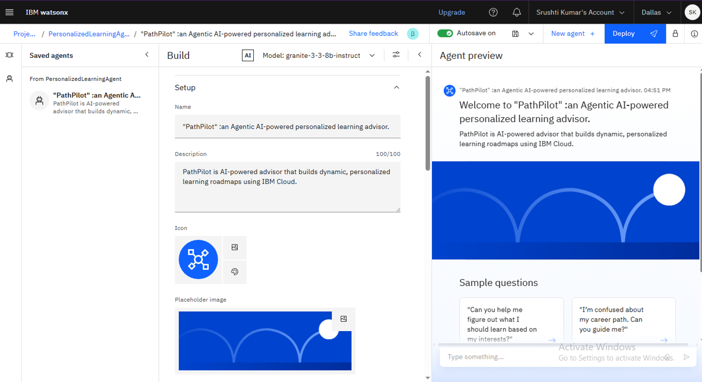
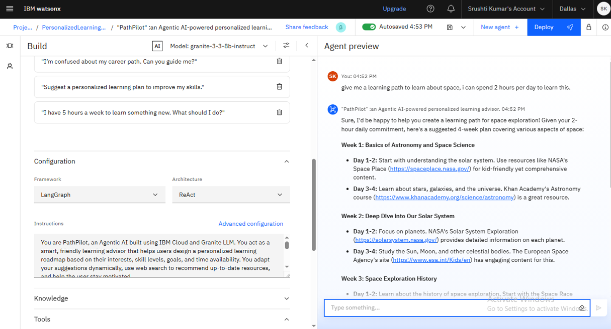
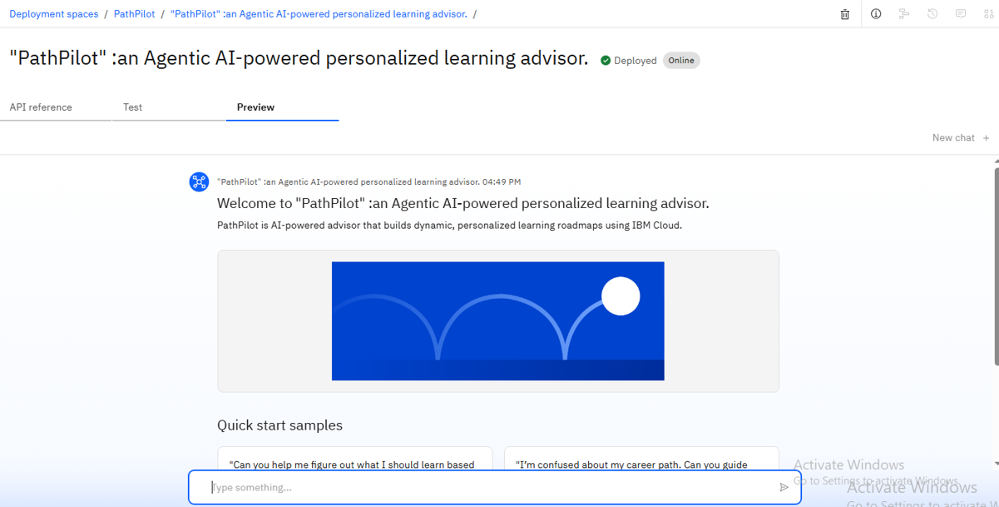
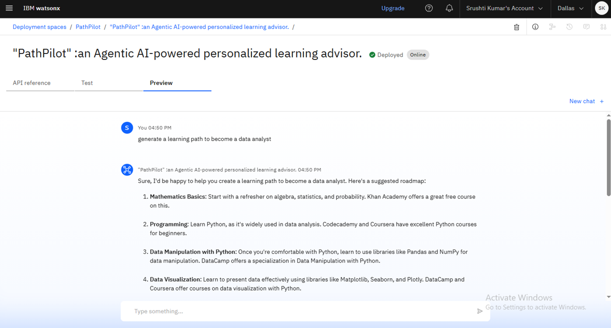

# 🚀 PathPilot – Your Personalized Learning Roadmap Advisor


---

## 🧠 What is PathPilot?

**PathPilot** is an Agentic AI-powered conversational assistant that helps learners of all backgrounds build a personalized, goal-driven course roadmap.

Whether you're a student, career switcher, or professional upskiller, PathPilot talks to you, learns from your responses, and crafts a dynamic 3-phase learning plan using **real-time web search** — all without requiring any pre-uploaded data.

---

## 🎯 Key Features

- ✅ **Conversational Agent** – Asks one question at a time to reduce user overwhelm
- 🔁 **Adaptive Roadmaps** – Updates course recommendations as you progress
- 🌐 **Live Web Search Integration** – Pulls latest free/paid course links from trusted platforms
- 🧩 **Minimal Input Needed** – Starts planning even from a single user response
- 📈 **Progress Tracking** – Allows users to log completions and automatically reshapes the plan
- 💬 **Motivational & Friendly** – Offers reminders, encouragement, and milestone messages
- 🌍 **Domain-Agnostic** – Works for tech, design, marketing, and more!

---

## 📸 Screenshots
### 🖥️ Agent Preview and Working




### 🗺️ Deployed Agent working preview



---

## 🏗️ Tech Stack

| Tool / Service         | Purpose                             |
|------------------------|-------------------------------------|
| IBM Granite LLM        | Language understanding and logic    |
| IBM Cloud Lite         | App deployment and orchestration    |
| Watsonx AI Studio      | Agentic AI development              |
| Python + Jupyter       | Backend logic and testing           |
| Web Search APIs        | Fetch real-time course links        |

---

## 📂 Project Structure

```plaintext
PathPilot/
├── PathPilot.ipynb         # Jupyter Notebook (core logic and agentic flow)
├── README.md               # This file
├── LICENSE                 # Project license file
├── /images/                # Screenshots of deployed AI
├── Project_Document        # Final project explanation
```

---

## 📽️ How It Works

1. **User starts a conversation** – PathPilot introduces itself and begins asking questions one by one.
2. **Learner answers questions** – Even partial or vague answers are accepted.
3. **PathPilot creates roadmap** – Divided into Foundations, Intermediate, and Capstone phases.
4. **User progresses and updates** – AI adapts recommendations dynamically.
5. **Courses fetched via web** – Real-time data ensures fresh content suggestions.

---

## 🌱 Future Improvements

- ✅ Multilingual Support  
- ✅ Mobile App Companion  
- ✅ Visual Progress Dashboard  
- ✅ Community + Peer Mentorship Features  
- ✅ Voice-based Input/Output  

---

## 📝 License

This project is licensed under the [MIT License](LICENSE).


